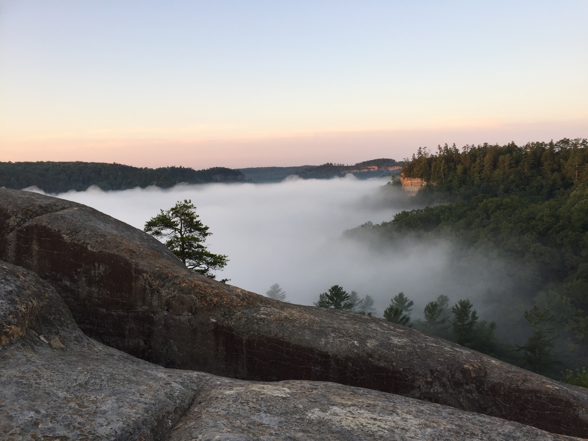
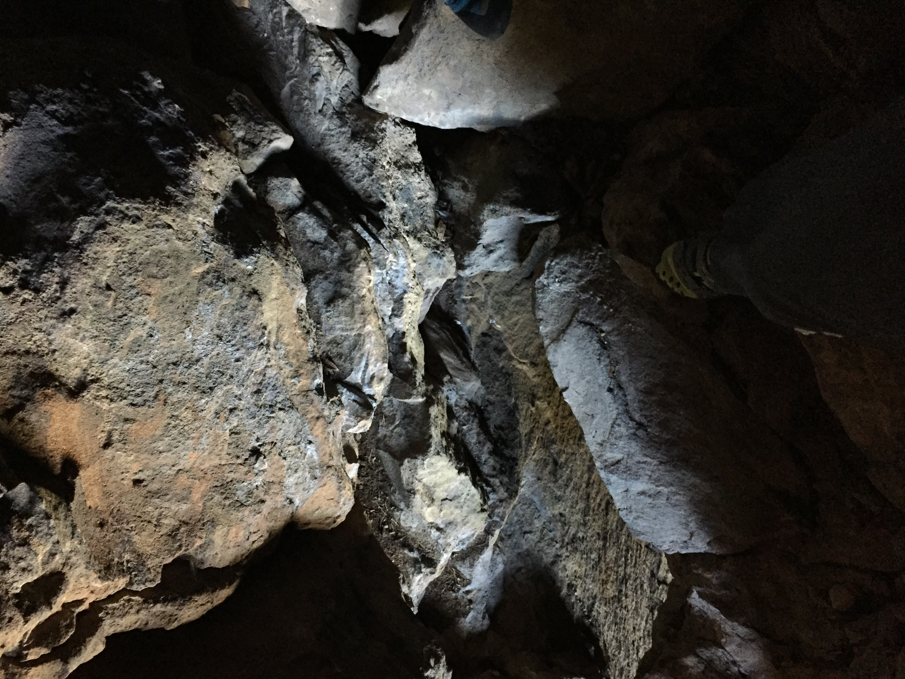
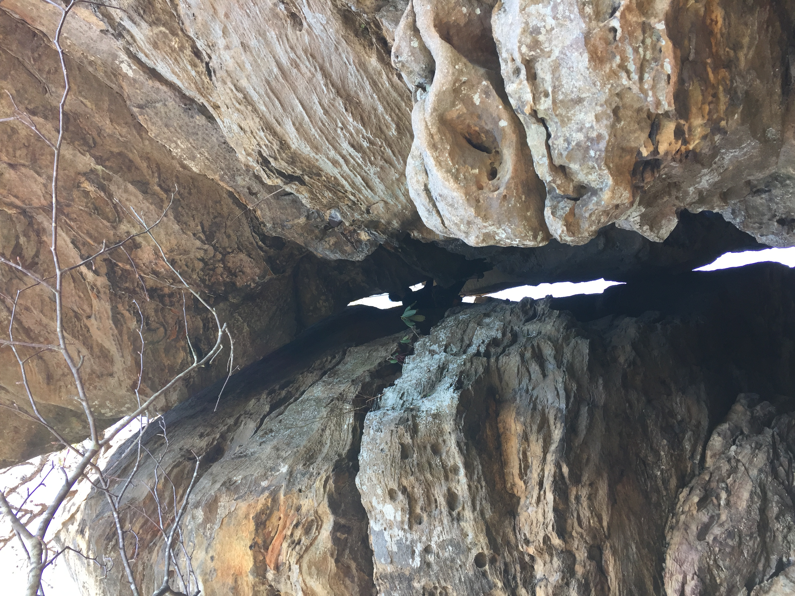
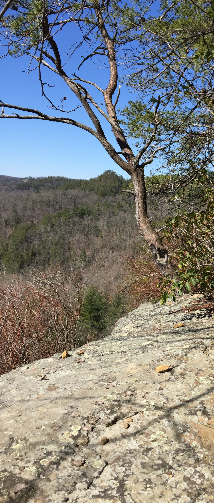
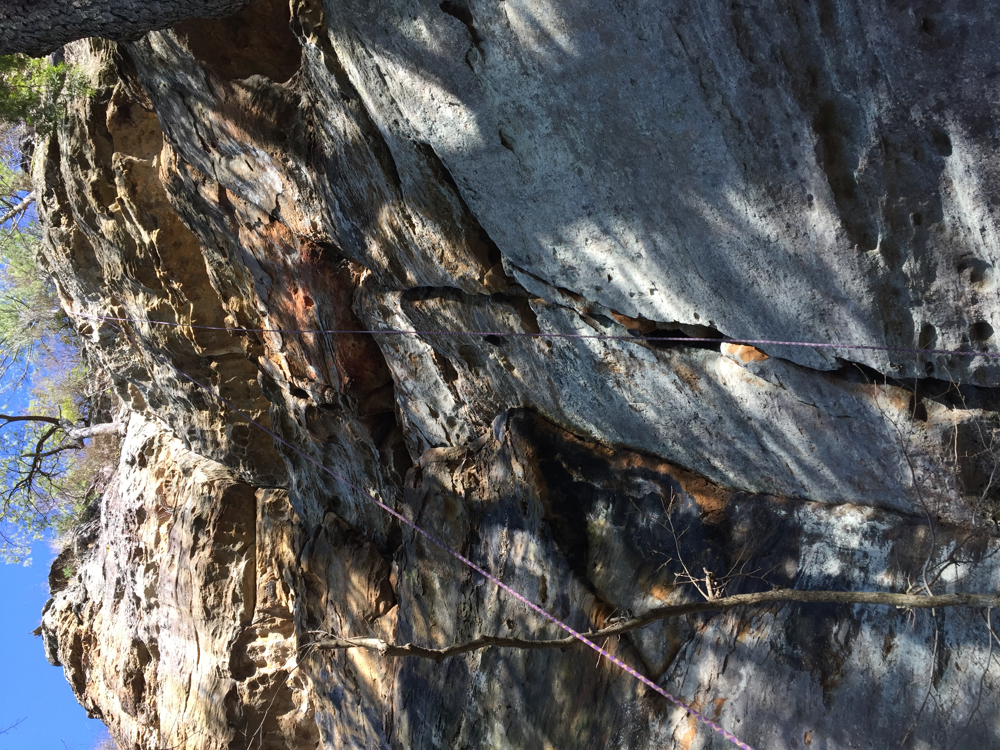
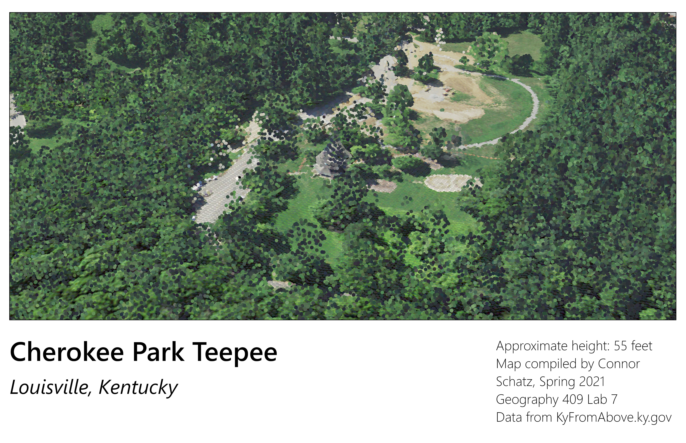

# rrg

Kentucky's Red River Gorge National Geological Area

## A Base map of arches

[Download a GeoPDF of arches](basemap/rrg.pdf)

https://wcschatz.github.io/rrg

## Some Photos from Red River Gorge

 _The valley from the top of Cloudsplitter_, Photo by Connor Schatz

 _Mid-climb of Caver's Route, Tower Rock_, Photo by Connor Schatz

 _The final pitch of the climb_, Photo by Connor Schatz

 _From the top of Tower Rock_, Photo by Connor Schatz

 _Repelling from the top of Tower Rock_, Photo by Connor Schatz

 _A LIDAR map of the Teepee in Cherokee Park, Louisville, KY_, Created by Connor Schatz

[3D render of the Cherokee Park Teepee](https://youtu.be/vMDUF8-S56U)